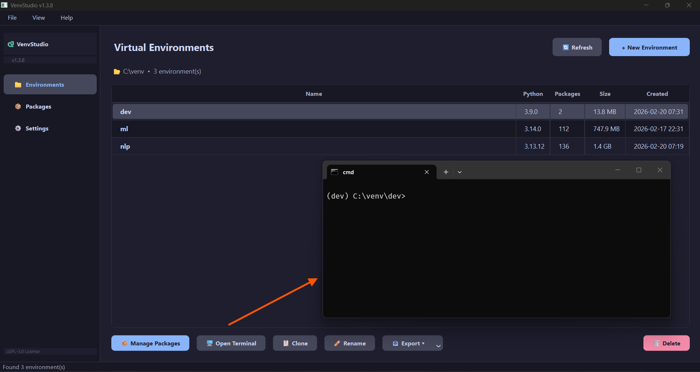
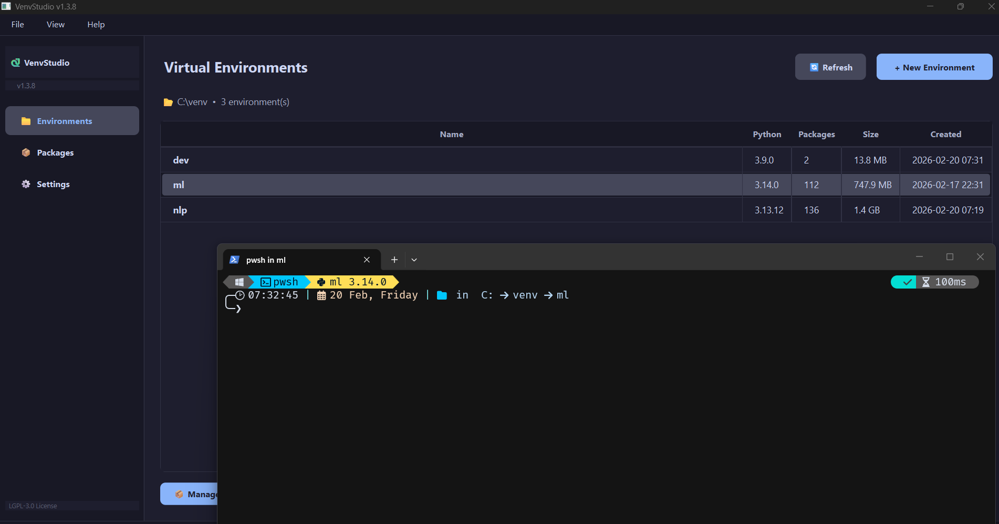
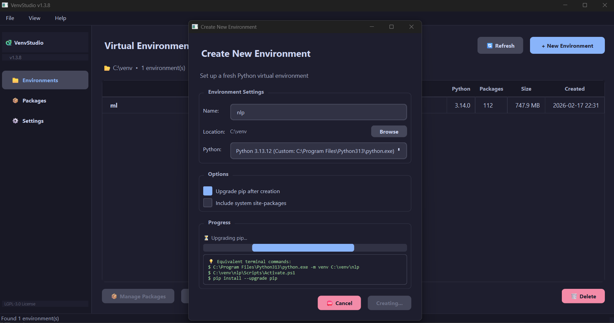
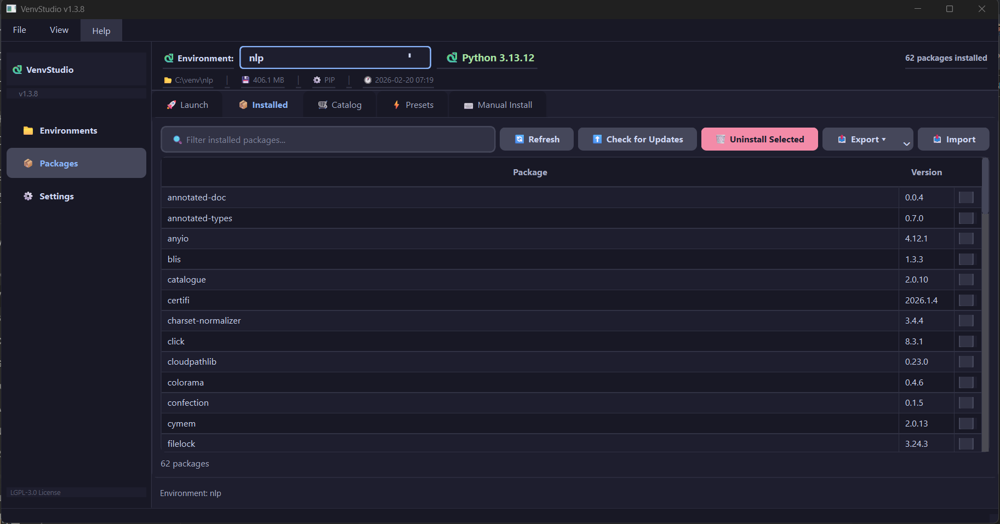
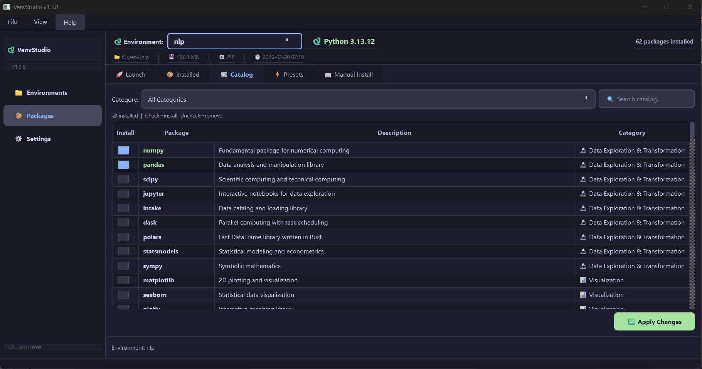
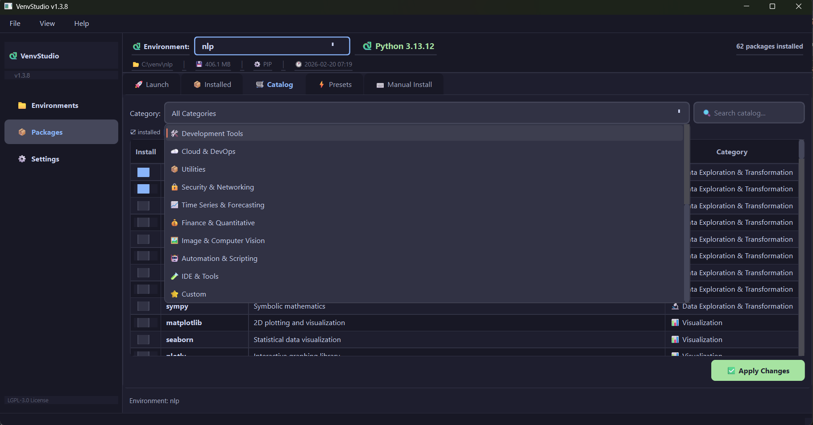
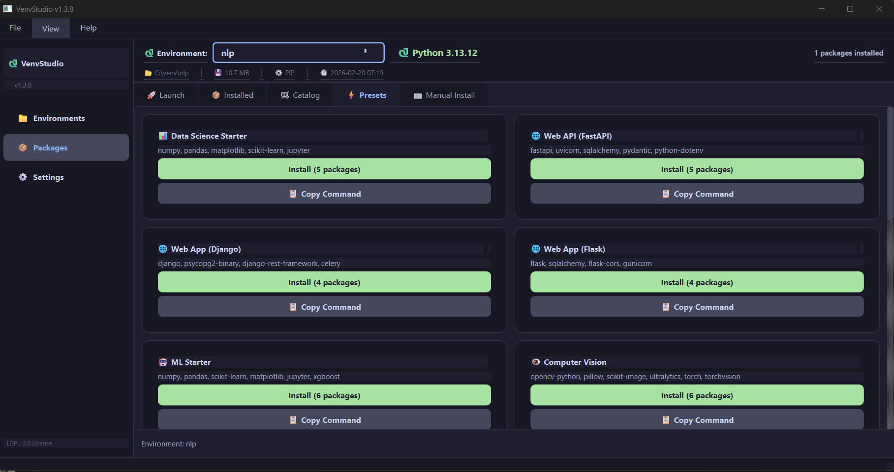
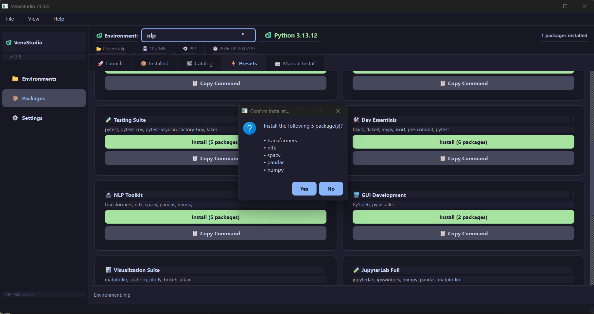
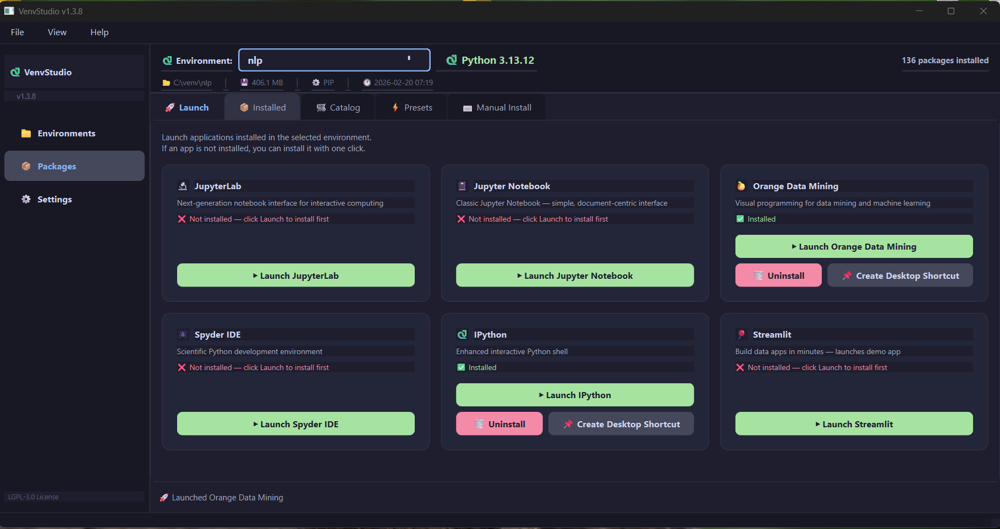
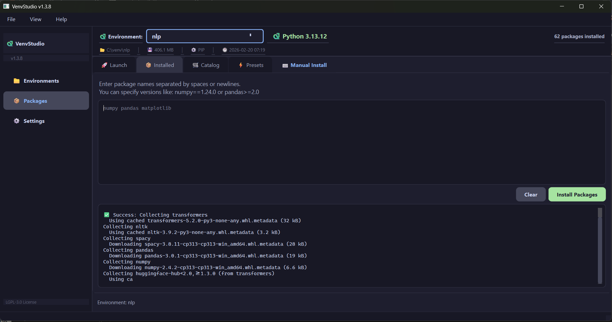

<p align="center">
  
</p>

<h1 align="center">VenvStudio</h1>

<p align="center">
  <strong>Lightweight Python Virtual Environment Manager</strong><br>
  A modern, cross-platform virtual environment manager
</p>

<p align="center">
  <a href="https://github.com/bayramkotan/VenvStudio/releases/latest">
    
  </a>
  <a href="https://pypi.org/project/venvstudio/">
    
  </a>
  <a href="https://pypi.org/project/venvstudio/">
    
  </a>
  <a href="LICENSE">
    
  </a>
  
</p>

---

## 📦 Install

```bash
pip install venvstudio
```

Or download the standalone binary from [GitHub Releases](https://github.com/bayramkotan/VenvStudio/releases/latest):

| Platform | File |
|----------|------|
| Windows | `VenvStudio.exe` |
| Linux | `VenvStudio-x86_64.AppImage` |
| macOS | `VenvStudio-macOS` |
| PyPI | `pip install venvstudio` |

---

## ✨ Features

- **Create & manage** Python virtual environments with a modern GUI
- **Package management** — install, uninstall, update packages via pip or uv
- **200+ package catalog** with categories (Data Science, Web, ML, NLP, DevOps...)
- **Quick presets** — Data Science Starter, Web API, Django, Flask, ML, NLP, Testing...
- **Launch apps** — JupyterLab, Orange Data Mining, Spyder, IPython, Streamlit with one click
- **Desktop shortcuts** — create `.lnk` shortcuts with app-specific icons
- **Export** — requirements.txt, Dockerfile, docker-compose.yml, pyproject.toml, Conda environment.yml
- **Python downloader** — download standalone Python builds (astral-sh/python-build-standalone)
- **PATH management** — set User/System default Python with admin elevation
- **Auto-update** — check PyPI for new versions on startup
- **Cross-platform** — Windows, macOS, Linux
- **Dark theme** — modern Catppuccin-based UI
- **Multilingual** — English & Turkish

---

## 📸 Screenshots

### Environments

Create, manage, clone, rename, delete virtual environments. Open terminal with activated environment.

<p align="center">
  
</p>

<p align="center">
  
</p>

### Create New Environment

Select Python version, location, and options. Shows equivalent terminal commands.

<p align="center">
  
</p>

### Installed Packages

View, filter, update, uninstall packages. Export in 6 formats. Right-click to copy pip commands.

<p align="center">
  
</p>

### Package Catalog

Browse 200+ packages organized by category. Check to install, uncheck to remove.

<p align="center">
  
</p>

<p align="center">
  
</p>

### Quick Presets

One-click install for common project setups: Data Science, Web API, Django, Flask, ML, NLP, Testing, and more.

<p align="center">
  
</p>

<p align="center">
  
</p>

### Launch Applications

Launch JupyterLab, Jupyter Notebook, Orange Data Mining, Spyder, IPython, Streamlit directly. Create desktop shortcuts.

<p align="center">
  
</p>

### Manual Install

Type or paste package names. Automatic cleanup of `pip install` prefixes and noise words.

<p align="center">
  
</p>

---

## 🚀 Quick Start

### From PyPI

```bash
pip install venvstudio
venvstudio
```

### From Source

```bash
git clone https://github.com/bayramkotan/VenvStudio.git
cd VenvStudio
pip install PySide6
python main.py
```

### CLI

```bash
venvstudio          # Launch GUI
venvstudio -V       # Show version
venvstudio -h       # Help
```

---

## 📤 Export Formats

Export your environment in multiple formats from the **Export ▾** dropdown:

| Format | File(s) | Use Case |
|--------|---------|----------|
| 📄 requirements.txt | `requirements.txt` | Standard pip |
| 🐳 Dockerfile | `Dockerfile` + `requirements.txt` | Docker container |
| 🐳 docker-compose.yml | 3 files | Docker Compose |
| 📦 pyproject.toml | `pyproject.toml` | Modern Python packaging |
| 🐍 environment.yml | `environment.yml` | Conda compatibility |
| 📋 Clipboard | — | Quick copy-paste |

---

## ⬇️ Python Downloader

Download standalone Python builds from [astral-sh/python-build-standalone](https://github.com/astral-sh/python-build-standalone) (same builds used by `uv`):

- **User Install** — no admin required, stored in VenvStudio config
- **System Install** — Windows (`C:\Program Files`), Linux (`/opt/python`), macOS (`/usr/local/python`)

---

## 🐍 PATH Management

Manage which Python is the default on your system:

- **Set User Default** — adds to User PATH, removes conflicting entries
- **Set System Default** — adds to System PATH with admin elevation
- Both modes clean conflicting Python entries from both User and System PATH

---

## 🔧 Settings

- Theme: Dark (Catppuccin), Light
- Language: English, Turkish
- Default package manager: pip or uv
- Custom venv base directory (default: `C:\venv` on Windows, `~/venv` on Linux/macOS)
- Python version management
- Check for updates on startup
- Export/Import settings

---

## 🏗️ Build from Source

```bash
pip install pyinstaller PySide6 Pillow
python build.py
```

This creates platform-specific binaries in the `dist/` folder.

---

## 📝 License

[LGPL-3.0](LICENSE)

---

## 🔗 Links

- [GitHub Repository](https://github.com/bayramkotan/VenvStudio)
- [PyPI Package](https://pypi.org/project/venvstudio/)
- [Releases](https://github.com/bayramkotan/VenvStudio/releases)
- [Issues](https://github.com/bayramkotan/VenvStudio/issues)
