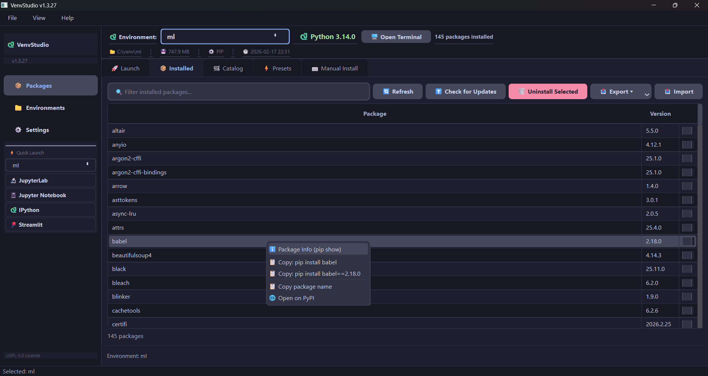
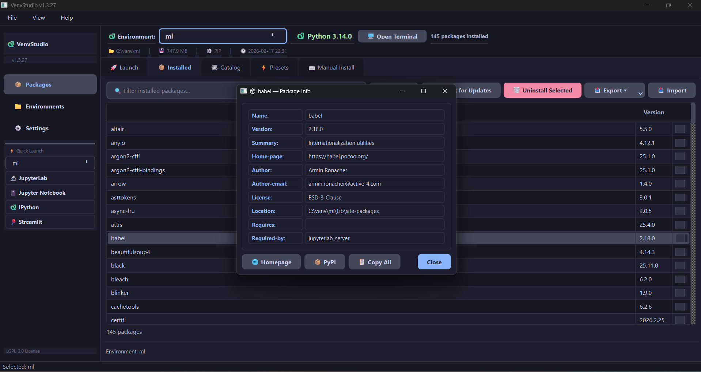

<p align="center">
  
</p>

<h1 align="center">🐍 VenvStudio</h1>

<p align="center">
  <strong>Lightweight Python Virtual Environment Manager</strong><br>
  <sub>Create, manage, and launch your Python environments — all from a modern GUI</sub>
</p>

<p align="center">
  <a href="https://github.com/bayramkotan/VenvStudio/releases/latest">
    
  </a>
  <a href="https://pypi.org/project/venvstudio/">
    
  </a>
  <a href="LICENSE">
    
  </a>
  
  <a href="https://github.com/bayramkotan/VenvStudio/stargazers">
    
  </a>
</p>

<p align="center">
  <a href="#-install">Install</a> •
  <a href="#-features">Features</a> •
  <a href="#-screenshots">Screenshots</a> •
  <a href="#-quick-start">Quick Start</a> •
  <a href="#-export-formats">Export</a> •
  <a href="#-build-from-source">Build</a>
</p>

---

## 📦 Install

```bash
pip install venvstudio
venvstudio
```

Or download the standalone binary — **no Python required:**

| Platform | File | Notes |
|:--------:|:-----|:------|
| 🪟 **Windows** | [`VenvStudio.exe`](https://github.com/bayramkotan/VenvStudio/releases/latest) | Portable — just run |
| 🐧 **Linux** | [`VenvStudio-x86_64.AppImage`](https://github.com/bayramkotan/VenvStudio/releases/latest) | `chmod +x` then run |
| 🍎 **macOS** | [`VenvStudio-macOS`](https://github.com/bayramkotan/VenvStudio/releases/latest) | Apple Silicon + Rosetta 2 |

---

## ✨ Features

<table>
<tr>
<td width="50%" valign="top">

### 🗂️ Environment Management
- Create, rename, clone, delete virtual environments
- Auto-detect existing environments at startup
- Per-environment cache — instant load, zero delays
- **Default Environment** — opens automatically on launch
- Open terminal with env pre-activated
- Export to 6 formats (see below)

</td>
<td width="50%" valign="top">

### 📦 Package Management
- **Installed** — filter, select, uninstall, export, import
- **Catalog** — 200+ curated packages across 15 categories
- **Presets** — one-click bundles (Data Science, Web API, Django, ML, NLP...)
- **Manual Install** — paste package names or version specs
- pip or **uv** backend (10–100× faster)
- Check for package updates

</td>
</tr>
<tr>
<td width="50%" valign="top">

### 🚀 Quick Launch
- Sidebar shows installed apps for active env
- One-click: JupyterLab, Notebook, Spyder, IPython, Orange, Streamlit, Gradio, Dash, FastAPI, TensorBoard, MLflow, and more
- **Jupyter Working Directory** — configurable per launch
- **Create Desktop Shortcut** for any app
- Instant sync across sidebar, table, and panel

</td>
<td width="50%" valign="top">

### 🐍 Python Management
- Auto-detect all system Python installations
- Add custom Python paths
- Set **User** or **System Default** Python (PATH management)
- Download standalone builds from [python-build-standalone](https://github.com/astral-sh/python-build-standalone)

</td>
</tr>
<tr>
<td width="50%" valign="top">

### ⚙️ Settings
- 🌙 Dark (Catppuccin) and ☀️ Light themes
- Font family and size customization
- 🌍 English & Turkish
- Custom venv directory, terminal, catalog, presets
- Export/Import settings
- Auto-check for updates

</td>
<td width="50%" valign="top">

### 🖥️ CLI/TUI Tools
- Install & configure **Starship** prompt
- Install & configure **Oh My Posh** prompt
- Install **Nerd Fonts** for proper rendering
- pip-installable: **Rich**, **Textual**, **Prompt Toolkit**

</td>
</tr>
</table>

---

## 📸 Screenshots

<details open>
<summary><b>🗂️ Environments</b></summary>
<br>
<p align="center">
  
</p>
</details>

<details>
<summary><b>🚀 Launch Apps</b></summary>
<br>
<p align="center">
  
</p>
</details>

<details>
<summary><b>📦 Installed Packages</b></summary>
<br>
<p align="center">
  
</p>
<p align="center">
  
</p>
<p align="center">
  
</p>
</details>

<details>
<summary><b>📚 Package Catalog</b></summary>
<br>
<p align="center">
  
</p>
</details>

<details>
<summary><b>⚡ Presets</b></summary>
<br>
<p align="center">
  
</p>
<p align="center">
  
</p>
</details>

<details>
<summary><b>📝 Manual Install</b></summary>
<br>
<p align="center">
  
</p>
</details>

<details>
<summary><b>⚙️ Settings</b></summary>
<br>
<p align="center">
  
</p>
<p align="center">
  
</p>
<p align="center">
  
</p>
</details>

---

## 🚀 Quick Start

### From PyPI

```bash
pip install venvstudio
venvstudio
```

### From Source

```bash
git clone https://github.com/bayramkotan/VenvStudio.git
cd VenvStudio
pip install PySide6
python main.py
```

### CLI

```bash
venvstudio          # Launch GUI
venvstudio -V       # Show version
venvstudio -h       # Help
```

---

## 📤 Export Formats

Export your environment from the **Export ▾** dropdown:

| Format | File(s) | Use Case |
|--------|---------|----------|
| 📄 requirements.txt | `requirements.txt` | Standard pip |
| 🐳 Dockerfile | `Dockerfile` + `requirements.txt` | Docker container |
| 🐳 docker-compose.yml | 3 files | Docker Compose |
| 📦 pyproject.toml | `pyproject.toml` | Modern Python packaging |
| 🐍 environment.yml | `environment.yml` | Conda compatibility |
| 📋 Clipboard | — | Quick copy-paste |

---

## ⬇️ Python Downloader

Download standalone Python builds from [astral-sh/python-build-standalone](https://github.com/astral-sh/python-build-standalone) (same builds used by `uv`):

- **User Install** — no admin required, stored in VenvStudio config
- **System Install** — Windows (`C:\Program Files`), Linux (`/opt/python`), macOS (`/usr/local/python`)

---

## 🏗️ Build from Source

```bash
pip install pyinstaller PySide6 Pillow
python build.py
```

GitHub Actions automatically builds Windows, Linux (AppImage), and macOS binaries on every tagged release.

---

## 📝 License

[LGPL-3.0](LICENSE)

---

<div align="center">

**Made with ❤️ by [Bayram Kotan](https://github.com/bayramkotan)**

[GitHub](https://github.com/bayramkotan/VenvStudio) · [PyPI](https://pypi.org/project/venvstudio/) · [Releases](https://github.com/bayramkotan/VenvStudio/releases) · [Issues](https://github.com/bayramkotan/VenvStudio/issues)

⭐ **If VenvStudio helps you, give it a star!** ⭐

</div>
