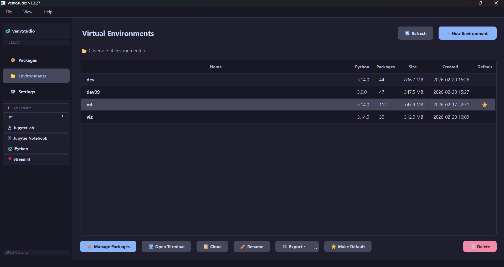
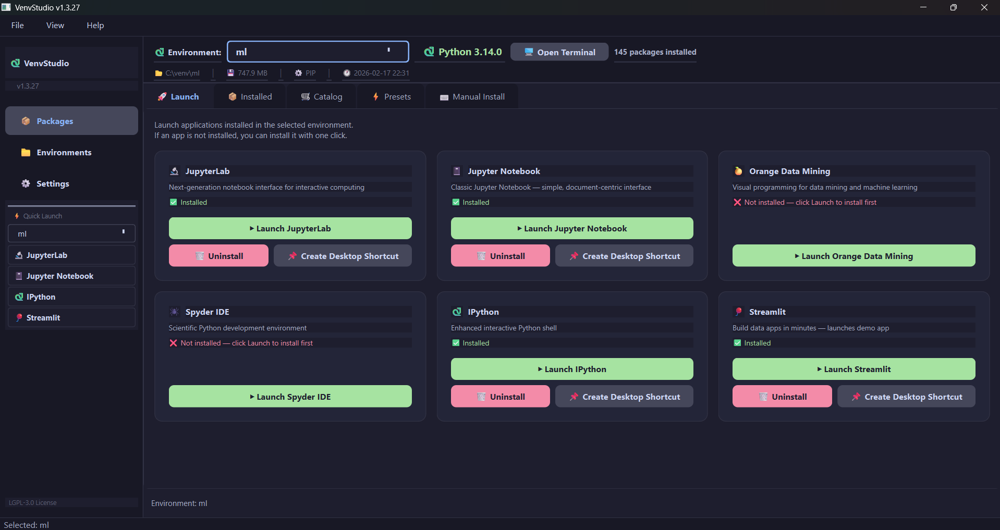
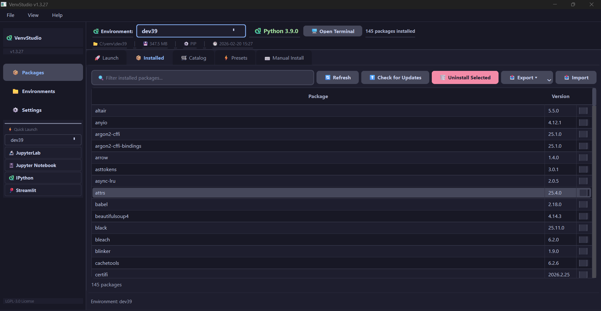
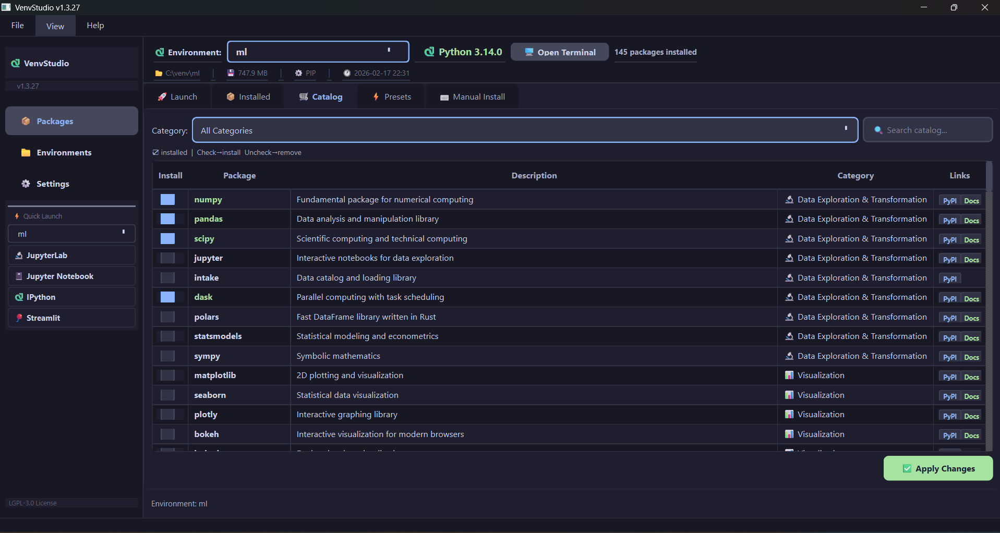
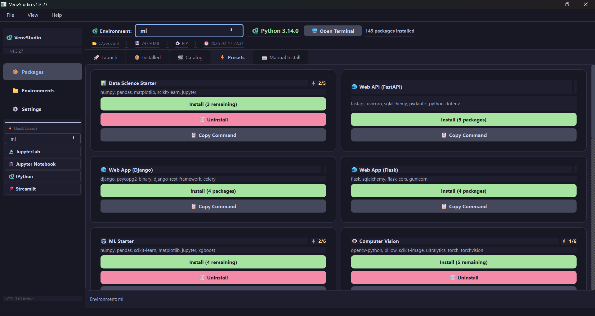
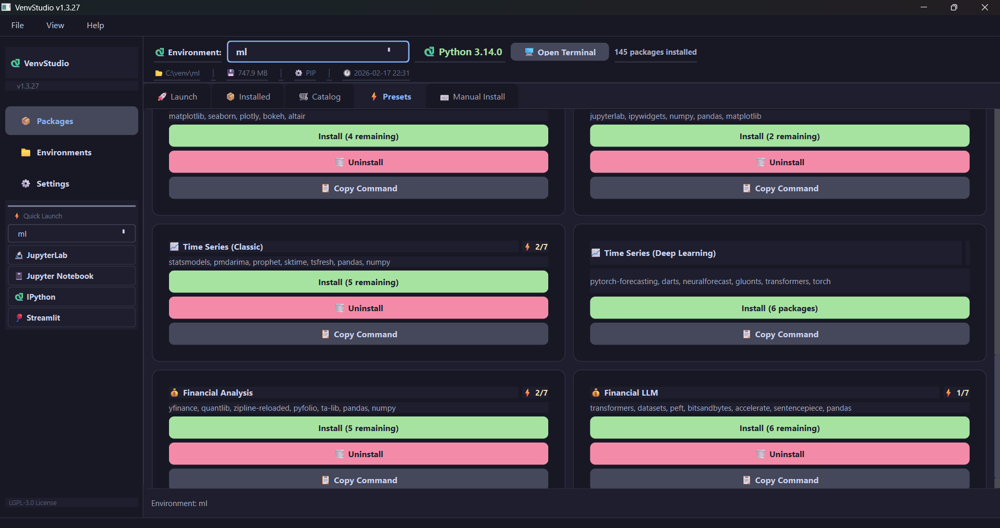
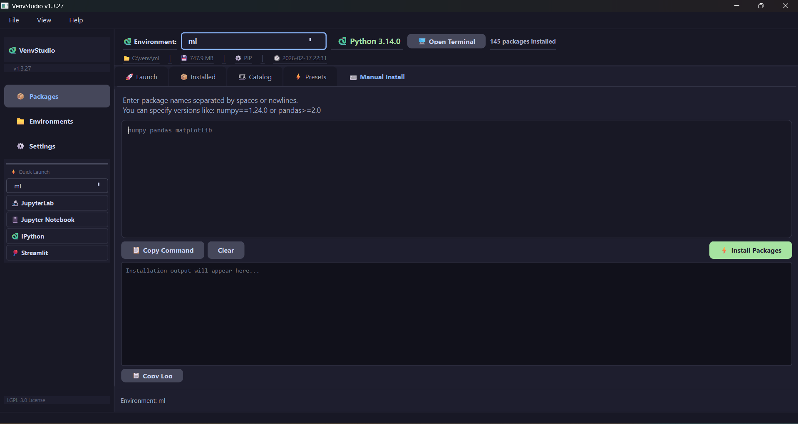
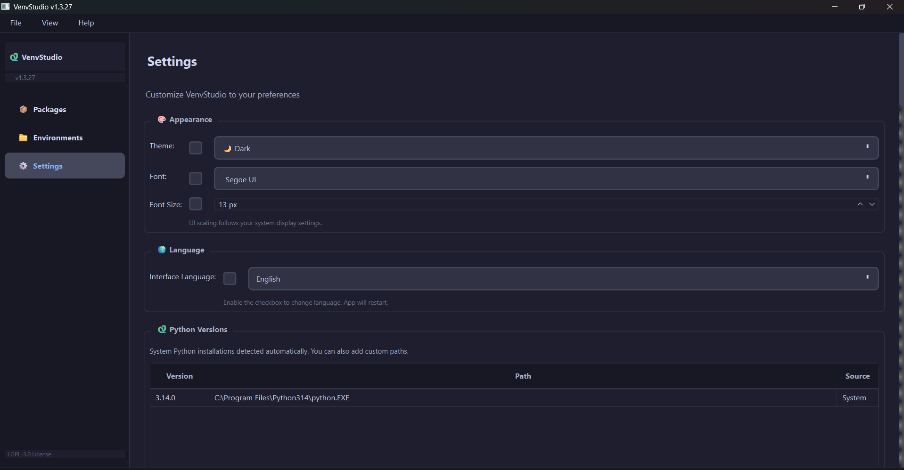
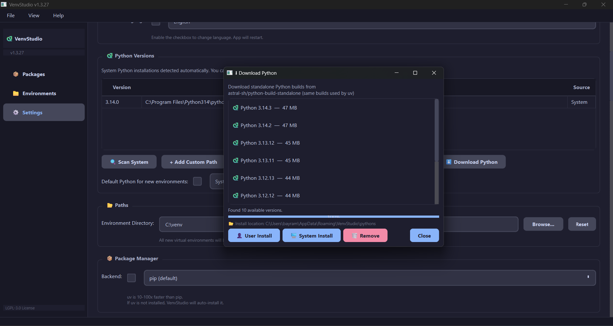
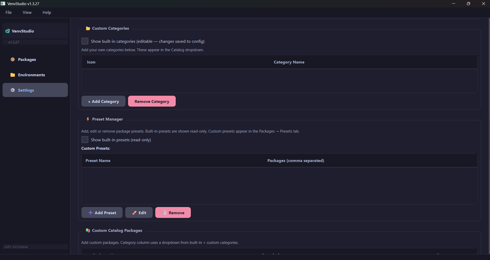

<p align="center">
  
</p>

<h1 align="center">VenvStudio</h1>

<p align="center">
  <strong>Lightweight Python Virtual Environment Manager</strong><br>
  A modern, cross-platform GUI for managing Python virtual environments
</p>

<p align="center">
  <a href="https://github.com/bayramkotan/VenvStudio/releases/latest">
    
  </a>
  <a href="https://pypi.org/project/venvstudio/">
    
  </a>
  <a href="https://pypi.org/project/venvstudio/">
    
  </a>
  <a href="LICENSE">
    
  </a>
  
</p>

---

## 📦 Install

```bash
pip install venvstudio
venvstudio
```

Or download the standalone binary from [GitHub Releases](https://github.com/bayramkotan/VenvStudio/releases/latest) — no Python required:

| Platform | File |
|----------|------|
| 🪟 Windows | `VenvStudio.exe` |
| 🐧 Linux | `VenvStudio-x86_64.AppImage` |
| 🍎 macOS | `VenvStudio-macOS` |

---

## ✨ Features

### 🗂️ Environment Management
- Create, rename, clone, delete virtual environments
- Auto-detect existing environments on disk at startup
- Per-environment cache — instant load, no subprocess delays
- Set a **Default Environment** that opens automatically on launch
- Open terminal with environment pre-activated (cmd, PowerShell, pwsh, bash, zsh, fish...)
- Export as `requirements.txt`, `Dockerfile`, `docker-compose.yml`, `pyproject.toml`, `environment.yml`

### 📦 Package Management
- **Installed** tab — filter, select, uninstall, export, import packages
- **Catalog** tab — 200+ curated packages across 15 categories with PyPI & Docs links
- **Presets** tab — one-click install bundles (Data Science, Web API, Django, Flask, ML, NLP, CV, Testing...)
- **Manual Install** tab — paste package names or version specs (`numpy==1.24`, `pandas>=2.0`)
- Check for package updates via pip
- Custom categories and custom catalog packages via Settings
- pip or **uv** backend (uv is 10–100× faster)

### 🚀 Quick Launch
- Sidebar shows installed apps for the active environment
- One-click launch: JupyterLab, Jupyter Notebook, Spyder IDE, IPython, Orange Data Mining, Streamlit
- **Create Desktop Shortcut** for any app
- Instant sync between sidebar dropdown, environment table, and package panel

### 🐍 Python Management
- Auto-detect all system Python installations
- Add custom Python paths
- Set **User Default** or **System Default** Python (PATH management with optional admin elevation)
- Download standalone Python builds from [astral-sh/python-build-standalone](https://github.com/astral-sh/python-build-standalone)

### ⚙️ Settings
- Dark (Catppuccin) and Light themes
- Font family and size customization
- Interface language: English / Turkish
- Custom venv base directory
- Custom terminal configuration (add, edit, remove)
- Custom Catalog categories and packages
- Diagnostics: open log folder, config folder, add Python to PATH, export/import settings
- Auto-check for updates on startup

### 🖥️ CLI/TUI Tools
- Install and configure **Starship**, **Oh My Posh** prompt themes
- Install **Nerd Fonts** for proper rendering
- pip-installable tools: **Rich**, **Textual**, **Prompt Toolkit**

---

## 📸 Screenshots

### Environments

<p align="center">
  
</p>

### Packages — Launch Apps

<p align="center">
  
</p>

### Packages — Installed

<p align="center">
  
</p>

### Packages — Catalog

<p align="center">
  
</p>

### Packages — Presets

<p align="center">
  
</p>

<p align="center">
  
</p>

### Packages — Manual Install

<p align="center">
  
</p>

### Settings

<p align="center">
  
</p>

<p align="center">
  
</p>

<p align="center">
  
</p>

---

## 🚀 Quick Start

### From PyPI

```bash
pip install venvstudio
venvstudio
```

### From Source

```bash
git clone https://github.com/bayramkotan/VenvStudio.git
cd VenvStudio
pip install PySide6
python main.py
```

### CLI

```bash
venvstudio          # Launch GUI
venvstudio -V       # Show version
venvstudio -h       # Help
```

---

## 📤 Export Formats

| Format | File(s) | Use Case |
|--------|---------|----------|
| 📄 requirements.txt | `requirements.txt` | Standard pip |
| 🐳 Dockerfile | `Dockerfile` + `requirements.txt` | Docker container |
| 🐳 docker-compose.yml | 3 files | Docker Compose |
| 📦 pyproject.toml | `pyproject.toml` | Modern Python packaging |
| 🐍 environment.yml | `environment.yml` | Conda compatibility |
| 📋 Clipboard | — | Quick copy-paste |

---

## ⬇️ Python Downloader

Download standalone Python builds from [astral-sh/python-build-standalone](https://github.com/astral-sh/python-build-standalone):

- **User Install** — no admin required, stored in VenvStudio config
- **System Install** — `C:\Program Files` on Windows, `/opt/python` on Linux, `/usr/local/python` on macOS

---

## 🏗️ Build from Source

```bash
pip install pyinstaller PySide6 Pillow
python build.py
```

GitHub Actions automatically builds Windows, Linux (AppImage), and macOS binaries on every tagged release.

---

## 📝 License

[LGPL-3.0](LICENSE)

---

## 🔗 Links

- [GitHub Repository](https://github.com/bayramkotan/VenvStudio)
- [PyPI Package](https://pypi.org/project/venvstudio/)
- [Releases](https://github.com/bayramkotan/VenvStudio/releases)
- [Issues & Feature Requests](https://github.com/bayramkotan/VenvStudio/issues)
